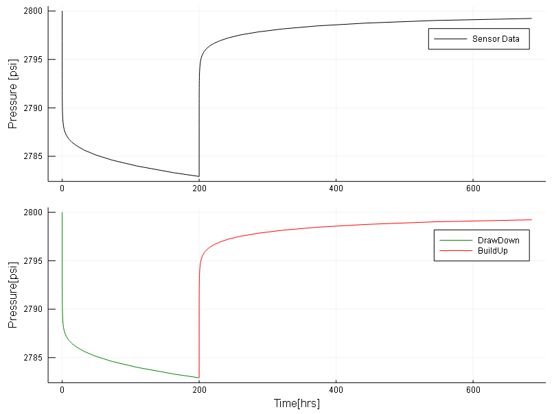
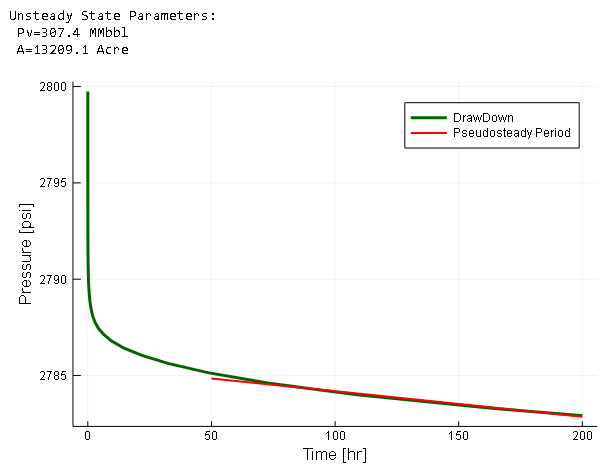
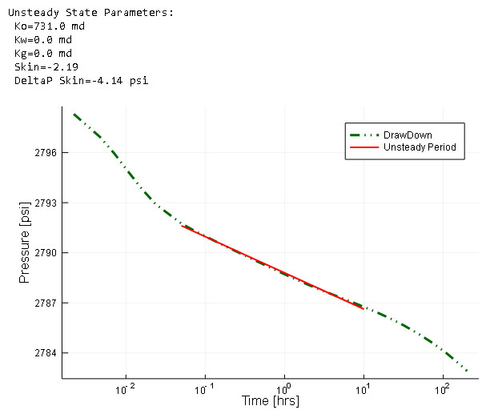
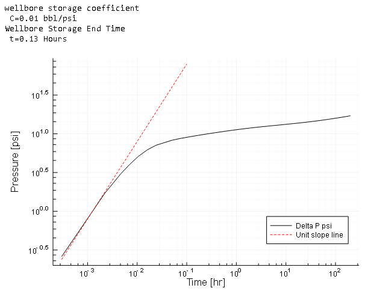
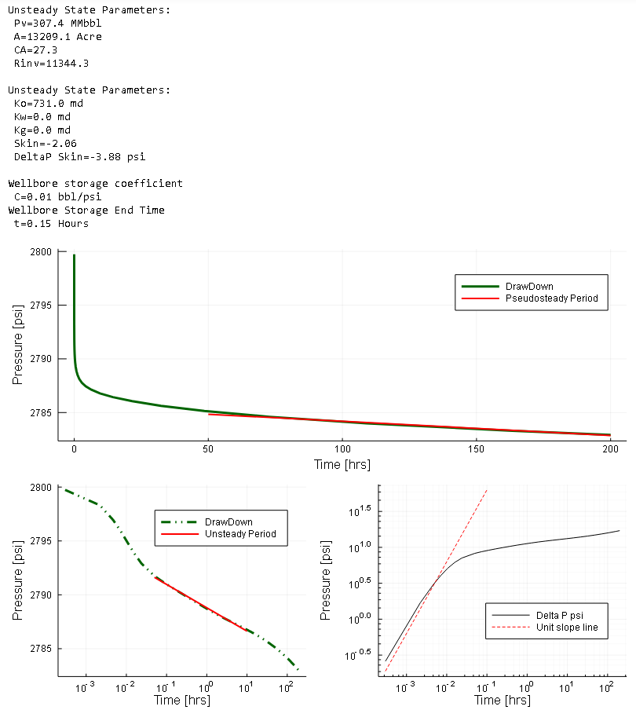
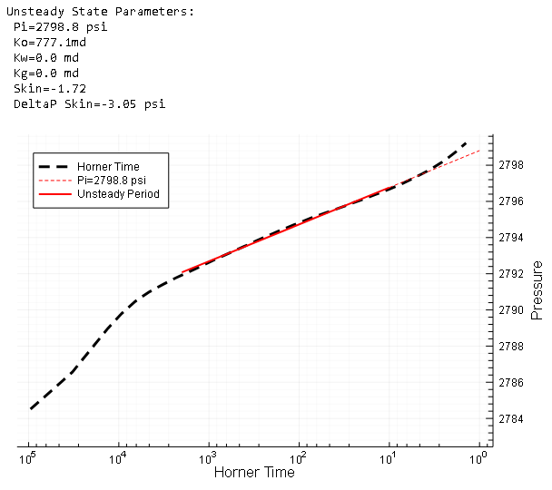
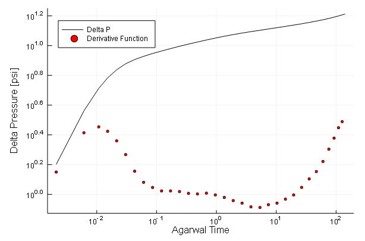

# WellTesting.jl

## Introduction.
This package is being designed among others to provide Petroleum Engineering tools in a modern programming language. This package is part of the project 7G which  proposes to make basic but powerful engineering software packages that cover the main topics of the Oil and Gas development phases which could be applied to any case study by suitable engineers.

There are five topics in which the project is going to be focused on:

<br>-Geoscience* (Current Package)
<br>-Reservoir
<br>-Production
<br>-Economics
<br>-Integration

<br> The package will always be in permanent development and open to suggestions to enhance the program. As the code has been written so far by a code enthusiastic Petroleum Engineer I hope to learn as much as possible to get better and usefull programs.

## WellTesting.jl Description

WellTesting.jl is a package that allows to carry out Pressure Test Analysis (DrawDown & BuildUp)


## Example

Given some Well pressure data

```julia
Data=CSV.read("WellData.csv")
DrawDown=Data[Data.Time .<=200,:]
BuildUp=Data[Data.Time .>=200,:];

p1=plot(Data.Time,Data.Pressure, linecolor = :black, ylabel="Pressure [psi]", label="Sensor Data")
p2=plot(DrawDown.Time,DrawDown.Pressure, linecolor = :green, xlabel=" Time[hrs]", ylabel="Pressure[psi]", label="DrawDown")
p2=plot!(BuildUp.Time,BuildUp.Pressure, linecolor = :red, label="BuildUp")
plot(p1,p2,layout=(2,1))
```
<br>

##  DrawDown

You can plot cartesian, semilog and loglog scale data by calling the Recipes  

### Cartesian scale
 You can simply call ```dd``` recipe to plot a cartesian scale data and the  
 pore volume calculated as well as the drainage area based on the slope of the  
 straight line which represent the Pseudosteady State flow.

```julia
 dd(DrawDown.Time,DrawDown.Pressure,
    PseudosteadyRange=[50,200], Q=[150,0,0],β=[1.3,0,0], μ=[1,1,1], h=20,Rs=0, ct=2e-6, rw=0.4, ϕ=0.15)
```
<br>

### Semilog scale

```julia
ddsl(DrawDown.Time[2:end],DrawDown.Pressure[2:end],
     UnsteadyRange=[0.05,10],Q=[150,0,0],β=[1.3,0,0], μ=[1,1,1], h=20,Rs=0, ct=2e-6, rw=0.4, ϕ=0.15, pr=true)
```
<br>

### LogLog scale

```julia
ddll(DrawDown.Time,DrawDown.Pressure,
    B=2.9, To=0.1,Q=150,β=1.2, k=730, h=20, μ=1, s=-2.19)
```
<br>

### Subplots

```julia
drawdown(DrawDown.Time,DrawDown.Pressure, UnsteadyRange=[0.05,10],PseudosteadyRange=[50,200], Q=[150,0,0],β=[1.3,0,0],
            μ=[1,1,1], h=20,Rs=0, ct=2e-6, rw=0.4, ϕ=0.15, pr=true, B=2.8, To=0.1)
```
<br>

## BuildUp

### Horner Plot

```julia
hornerplot(BuildUp.Time,BuildUp.Pressure,
 UnsteadyRange=[10.0,2000.],Q=[150.0,0.0,0.0],β=[1.3,0,0], μ=[1.,1.,1.], h=20.0,Rs=0, ct=2e-6, rw=0.4, ϕ=0.15)
```
<br>

### Derivative Plot

```julia
derivativeplot(BuildUp.Time,BuildUp.Pressure)
```
<br>

## References

- Ahmed, P. P., & McKinney, P. (2011). Advanced Reservoir Engineering. Elsevier Science.  
-Lee, J. (1982). Well testing.  
-Chapra, S. C., & Canale, R. P. (1988). Numerical methods for engineers. McGraw-Hill  
-Macualo, Freddy Humberto Escobar. Novel, Integrated and Revolutionary Well Test Interpretation and Analysis. IntechOpen, 2019.
